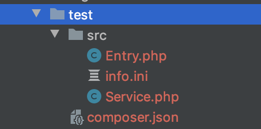
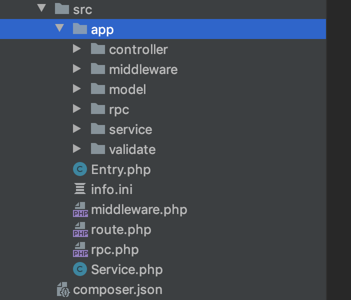

---

---

## Think-addon 


### **一、安装**


**添加composer自定义仓库配置：**

```
"repositories": {
        "think-addon": {
            "type": "vcs",
            "url": "git@gitlab.bjyybao.com:ningfei/think-addon.git"
        }
    }
```

**安装：**

`composer require think/addon:dev-master`

**修改扩展命令**

```
"scripts": {
        "post-autoload-dump": [
            "@php think service:discover",
            "@php think vendor:publish",
            "@php think addon-service:discover"
        ]
    }
```


### **二、创建**


**命令行新增一个插件，会在/addon下生成**

```
php think addon:build 【插件标识（插件目录名称）】【插件类型 0 系统 1 用户】

ps: php think addon:build test 1

```

)

- 默认根命名空间 `Addon\Test`，插件标识的驼峰名
- info.ini                                 插件的基本信息配置 
  - name                            插件标识
  - title                               插件名称
  - description                  插件描述
  - version                         插件版本 遵循PHP版本名称，如 1.0.0
  - state                             插件状态 0 禁用 1 开启
  - type                              插件类型  0  系统 1 用户
- Entry.php                            插件入口文件，提供插件的安装、卸载、钩子的注册和执行功能
  - install()                         安装插件触发方法
  - uninstall()                    卸载插件触发方法
  - index()                          插件首页
- Service.php                         插件服务类


### 三、应用配置文件

**安装扩展后会在config下生成addon.php 配置文件**

```
<?php

return [
    // 开启插件服务
    'enable' => true,
    // 是否检测用户插件权限
    'check_addon_permission' => true,
    // 用户授权中间件别名
    'addon_permission_middleware_alias' => 'auth',
    // 默认用户授权中间件
    'addon_permission_middleware_default' => \think\addon\middleware\AddonPermissionMiddleware::class,
    // 插件表默认表名
    'addon_db' => [
        'addon' => 'addon',
        'hook' => 'hook',
    ],
    // 默认缓存类型
    'cache_type' => 'redis',
];
```

### 四、数据库安装

**该插件依赖插件表和钩子表，可通过think-migrate迁移工具快速安装：**

`php think migrate:create Addon`

`php think migrate:create Hook`

**拷贝database/addon.php 和 database/hook.php内容到创建的文件中：**

`php think migrate:run`

### 五、功能使用

**<u>插件本身是一个独立的功能，仅提供钩子和RPC类给其他模块使用</u>**


> #### **钩子**


**1、创建钩子**，在Entry.php创建一个方法并添加注解：

```
/**
 * @title(这是钩子的名称)
 * @description(这是钩子的描述)
 */
public function foo()
{
    
}
```

**2、使用钩子**，在任何地方添加如下代码：

`hook('addon.test.foo')`

**3、钩子命名规则**：`'addon.' + 插件标识 + '.' + 方法名转下划线格式` 


> #### 插件配置文件


1、config.php                        **通用配置文件**

```
<?php 

return [
	'abc' => 'xx'
];

```

使用：

```
① aconfig('test', 'config');
② \think\addon\facade\Manager('test', 'config');
```

2、route.php                              **路由配置**

```
除以下两点不同，其他和thinkPHP原有的路由定义没有区别：
① 需要使用路由到类的方式定义插件路由，如 Route::get('', '\addon\test\Index@index');
② 会在原有的基础上添加固定前缀，如定义''则访问时地址为 /addon/test，即 'addon/插件标识/自定义路由' 
```

3、event.php                              **事件配置**

```
默认在原基础上添加前缀，避免和框架产生冲突：'addon.event.插件标识.自定义事件标识' 
```

4、middleware.php                **中间件配置**

```
<?php 

return [
	// 默认在原基础上添加前缀，避免和框架产生冲突：'addon.middleware.插件标识.别名' 
	'alias' => [
	
	],
	// 路由中间件
	'route' => [
	
	],
	// 全局中间件
	'global' => [
	
	]
];
```

5、rpc.php                               **rpc服务配置文件**

```
<?php 

return [
  'tt' => RpcClass::class,
];
```

使用：

```
rpc('test.tt');
```


> #### 应用分层

**推荐使用如下分层：**




- 控制器继承抽象类 `\think\addon\AddonBaseController`
- RPC类继承抽象类 `think\addon\AbstractRpc`
- 其他随意


### 四、安装

**第一次安装修改composer.json配置**

```
"autoload": {
        "psr-4": {
            "app\\": "app"
        },
        "psr-0": {
            "": "extend/"
        },
        "classmap": [
            "addon/"
        ]
    },
```

1、执行命令 `composer dump-autoload` 刷新缓存

2、访问 `you_web_http_url/addon/addon_list` 安装，